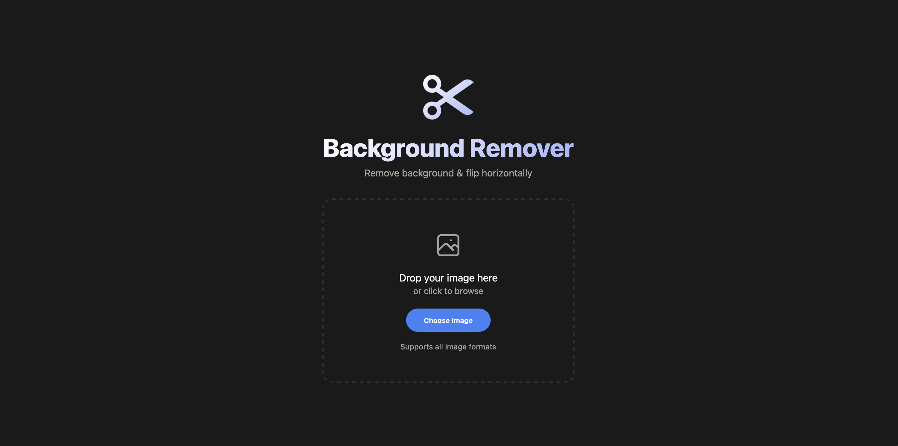
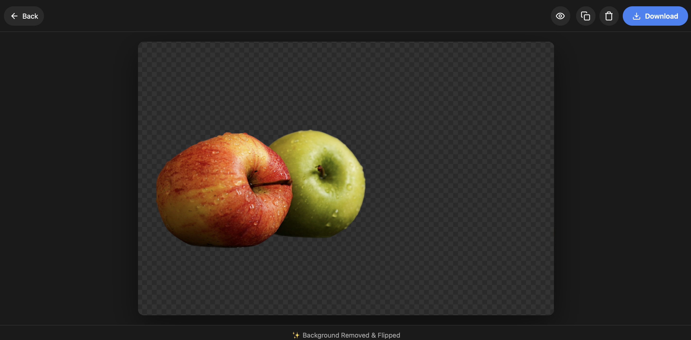

#  Background Remover

A full-stack web application that removes backgrounds from images using AI and optionally flips them horizontally. Built with a modern tech stack featuring React 19, TypeScript, and Express.

##  Try It Here

**Live Demo:** [https://image-background-remover-ovub.vercel.app](https://image-background-remover-ovub.vercel.app)

---

##  Preview

### Initial Upload View


### Processed Image View


---

##  Features

- **AI-Powered Background Removal** – Automatically removes backgrounds from images using the ClipDrop API
- **Horizontal Flip** – Automatically flips processed images horizontally
- **Instant Preview** – View original vs processed image with hold-to-compare functionality
- **One-Click Download** – Download processed images with proper naming
- **Copy URL** – Share processed images via direct URL
- **Cloud Storage** – Images stored securely on Google Cloud Storage
- **Responsive Design** – Works seamlessly on desktop and mobile devices
- **Real-time Processing Feedback** – Visual loading indicator during image processing

---

##  Tech Stack

### Frontend
| Technology | Purpose |
|------------|---------|
| **React 19** | UI Framework |
| **TypeScript** | Type-safe JavaScript |
| **Vite** | Build tool & dev server |
| **CSS3** | Styling with modern features |

### Backend
| Technology | Purpose |
|------------|---------|
| **Express.js** | Node.js web framework |
| **TypeScript** | Type-safe backend code |
| **Sharp** | Image processing & manipulation |
| **Multer** | File upload handling |
| **Google Cloud Storage** | Image storage |
| **ClipDrop API** | AI background removal |

### Deployment
| Technology | Purpose |
|------------|---------|
| **Vercel** | Frontend & Backend hosting |
| **Workload Identity Federation** | Secure GCP authentication |

---

##  Project Structure

```
Background Remover/
├── frontend/                 # React frontend application
│   ├── src/
│   │   ├── App.tsx          # Main application component
│   │   ├── components/      # Reusable UI components
│   │   └── globals.css      # Global styles
│   └── package.json
│
├── backend/                  # Express backend API
│   ├── src/
│   │   ├── index.ts         # API routes & server
│   │   └── lib/
│   │       ├── clipdrop.ts  # ClipDrop API integration
│   │       ├── imageProcessor.ts  # Sharp image processing
│   │       └── storage.ts   # Google Cloud Storage
│   └── package.json
│
└── package.json              # Root package with scripts
```

---

##  Getting Started

### Prerequisites

- Node.js 18+
- npm or yarn
- Google Cloud Storage bucket
- ClipDrop API key

### Environment Variables

Create a `.env` file in the `backend/` directory:

```env
CLIPDROP_API_KEY=your_clipdrop_api_key
GCS_BUCKET_NAME=your_gcs_bucket_name
GOOGLE_CLOUD_PROJECT=your_gcp_project_id
```
### Installation

1. **Clone the repository**
   ```bash
   git clone https://github.com/soumithganji/ImageBackgroundRemover.git
   cd background-remover
   ```

2. **Install all dependencies**
   ```bash
   npm run install:all
   ```

3. **Start development servers**
   ```bash
   npm run dev
   ```

   This will start:
   - Frontend at `http://localhost:5173`
   - Backend at `http://localhost:3001`

### Build for Production

```bash
npm run build
```

---

##  API Endpoints

| Method | Endpoint | Description |
|--------|----------|-------------|
| `POST` | `/api/upload` | Upload and process an image |
| `GET` | `/api/download/:id` | Download processed image |
| `DELETE` | `/api/delete?imageId=:id` | Delete a processed image |
| `GET` | `/api/images/:id` | Get image URLs |
| `GET` | `/api/health` | Health check endpoint |

---

##  How It Works

1. **Upload** – User uploads an image
2. **Process** – Backend receives the image and:
   - Sends it to ClipDrop API for background removal
   - Flips the result horizontally using Sharp
3. **Store** – Processed image is uploaded to Google Cloud Storage
4. **Display** – Frontend receives the public URL and displays the result
5. **Download/Share** – User can download or copy the URL for sharing